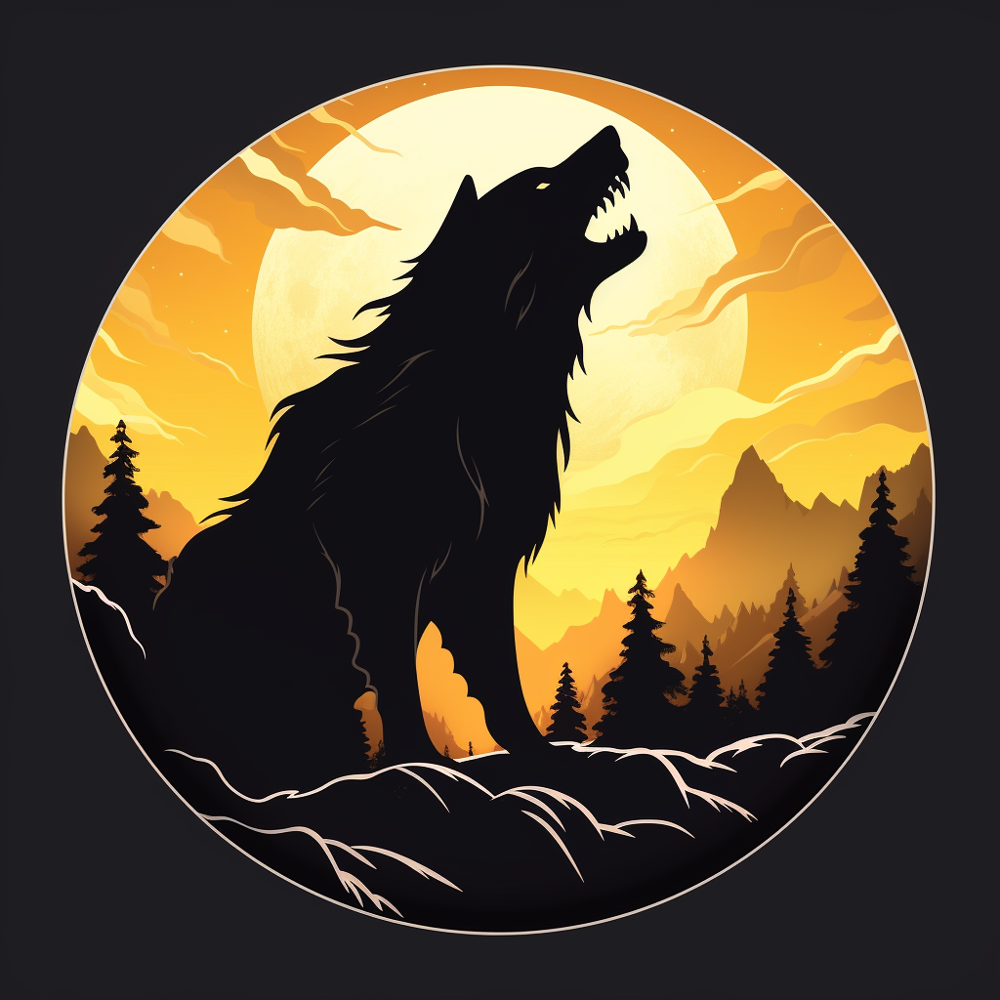
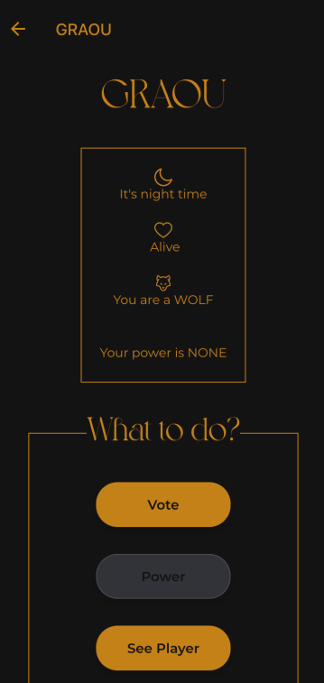
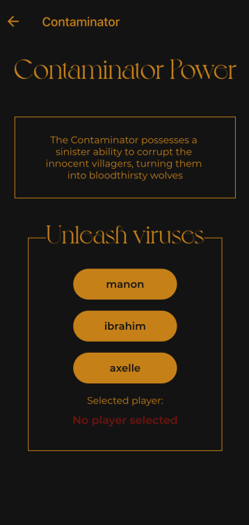

<a name="readme-top"></a>
[](https://github.com/julienbrs)
[![LinkedIn][linkedin-shield]][linkedin-url]

<!-- PROJECT LOGO -->
<br />
<div align="center">
  <a href="https://github.com/your-username/wolfo">
    
  </a>

<h3 align="center">Wolfo - Werewolves of Miller's Hollow App</h3>

</div>

<!-- TABLE OF CONTENTS -->

<summary>Table of Contents</summary>
<ol>
<li><a href="#about-the-project">About The Project</a></li>
<li><a href="#getting-started">Getting Started</a>
    <ul>
    <li><a href="#prerequisites">Prerequisites</a></li>
    <li><a href="#installation">Installation</a></li>
    <li><a href="#usage">Usage</a></li>
    </ul>
</li>
<li><a href="#contact">Contact</a></li>
</ol>

<br />

<!-- ABOUT THE PROJECT -->

## About The Project


"Wolfo" is a React Native application based on the popular game "Werewolves of Miller's Hollow". It is designed to provide an engaging and interactive experience for players who enjoy strategic and role-playing games.

<p align="center">
  
</p>

<p align="right">(<a href="#readme-top">back to top</a>)</p>

<!-- GETTING STARTED -->

## Getting Started

### Prerequisites

- Install pnpm globally on your system:
  ```sh
  npm install -g pnpm
  ```

### Installation

- After installing pnpm, run the following command to install the necessary packages:
  ```sh
  pnpm install
  ```
- Database Setup:

  - Navigate to the packages/database folder.
  - Copy and paste .env.example into a new file named .env.
  - Run pnpm docker:init to create a Docker image for the PostgreSQL database.
  - Run pnpm db:init to initialize the database with the required tables.

- Backend Setup:

  - Copy and paste the apps/api/.env.example file into a new file named .env within the apps/api/ directory.
    For development mode, run pnpm dev from the root directory. For building, run pnpm build.

- Frontend Setup:

  - Navigate to the apps/wolfo directory and run pnpm start. The application supports web, Android, and iOS platforms.

> **_NOTE:_** The application was previously deployed on Scalingo but is not active anymore. When running the application locally, it will attempt to use the API previously deployed on Scalingo. To switch to a local API, you will need to modify the baseUrl in the apps/wolfo/src/api/api.ts file.

<p align="right">(<a href="#readme-top">back to top</a>)</p>

<p align="center">
  
</p>

### Usage

"Wolfo" is based on the traditional game "The Werewolves of Miller’s Hollow". It’s a game of strategy, deceit, and deduction where players take on roles of Villagers, Werewolves, or special characters with unique abilities. Below is a quick guide on how to use the app:

#### Roles

- **Villager**: Every player is a villager and may have a specific role (Human or Werewolf).
  - **Functions**:
    - Participate in discussions.
    - Vote during the day to eliminate a player.
- **Werewolf**:

  - **Functions**:
    - Participate in confidential discussions with other werewolves.
    - Vote to eliminate a player during the night.

- **Contaminator Werewolf**: Has the power to turn a human into a werewolf each night.

- **Human**: A specific role aiming to eliminate werewolves.

- **Insomniac (Human)**: Can observe the werewolf's discussions during the night without participating.

- **Spiritism**: Can communicate with eliminated players during the night.

- **Seer**: Can discover the role and powers of another player once per night.

#### Powers Usage

- **Contamination**: Reserved for werewolves. If you’re a Contaminator Werewolf, select a non-werewolf player to contaminate by pressing the "Power" button. The selected player will turn into a werewolf.

- **Insomniac**: Allows human players to observe werewolf discussions during the night by pressing the "Power" button.

- **Spiritism**: Allows communication with eliminated players. Select a player from the list of eliminated players, and you can chat with them until the night ends.

- **Seer (Voyance)**: Discover the role and power of a live player by pressing the “Power” button and selecting a player. You can read the selected player’s information until the night ends.

#### Gameplay

1. **Start the Game**: Players are assigned roles secretly. Werewolves are informed of their fellow werewolves, but villagers don’t know who the other villagers or werewolves are.
2. **Night Phase**: Werewolves select a player to eliminate, and players with special powers may use them. The game moves to the day phase when all actions are completed.
3. **Day Phase**: Players discuss and deduce who the werewolves might be. A vote is held, and the player with the most votes is eliminated.
4. **Repeat**: Continue the cycle of night and day until all werewolves are eliminated, or werewolves outnumber villagers.

Players use the app's interface to participate in discussions, cast votes, use powers, and follow the game's progression.

<p align="right">(<a href="#readme-top">back to top</a>)</p>
<!-- CONTACT -->

## Contact

Bourseau Julien - _2nd year student at Ensimag, 2022_ - julien.bourseau@gmail.com

Project Link: https://github.com/julienbrs/Werewolves-Game-App

<p align="right">(<a href="#readme-top">back to top</a>)</p>

[linkedin-shield]: https://img.shields.io/badge/-LinkedIn-black.svg?style=for-the-badge&logo=linkedin&colorB=555
[linkedin-url]: https://www.linkedin.com/in/julien-bourseau-ba2239228
